# Reverb

_The card-shedding game of matching both past and present_

## TLDR

Each card has two items. You may play any card from your hand if either of the items on the card match either of the items on the last card.

If the other item on your card also matches the next-to-last card, you can keep playing. 

The game ends when your "Completions" counter hits 3. Your score is the number in your "Turns" counter. Try to beat your lowest score!

## On Your Turn

1. Draw (optional/if stuck): Take 1 card from the draw pile.
2. Once per game, you may decide to use Reverse rules, wherein you may play a card only if it _doesn't_ match the last card.
   * See the section below on reverse matching rules
4. Play: Place a card matching at least one item on the last card in the queue.
5. Reverb: If the other item also matches the second-to-last card, immediately play again.
   * Keep chaining as long as you can.
   * Each play shifts the queue forward (last → second-to-last). The card you just played becomes the new last card.
6. If you play your last card, the "Completions" counter goes up.
   * If your card matches both the last card and the next-to-last card, you draw seven new cards and your turn continues.
   * If not, your turn ends, but you still draw seven new cards before your next turn starts.
7. Your turn ends and the "Turns" counter goes up when one of the following happens:
   * You play a card that matches the last card, but not the next-to-last card
   * You have no card that matches the last card
   * You decide not to play any more cards
  
## Draw Cards

1. After playing a Draw, immediately place the next card from the deck as the new last card in the queue.
2. If this play lets you continue (if your Draw card matched both of the last two cards in the queue), proceed with your turn.
3. If not, begin your next turn by placing another card from the deck as the new last card.
4. If a newly drawn queue card is a Draw, immediately add one card to your hand before continuing your turn (or starting your next turn).

## Matching Rules

Each card has two items. You can play any card if either item matches either item on the last card played.

Numbers match themselves (but not other numbers)

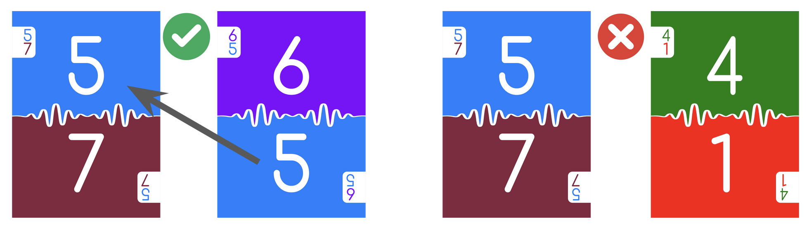

Ranges (1-4 and 4-7) match numbers they contain but not other ranges.

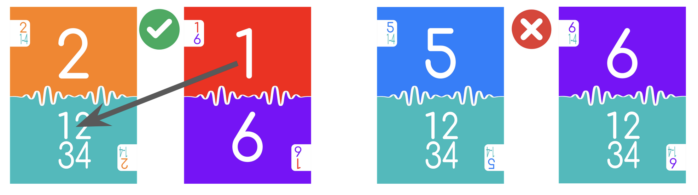

Draw matches another draw (and wild), but not numbers or ranges. When you play a draw card, each player (except you) draws one card from the draw pile into their hand.

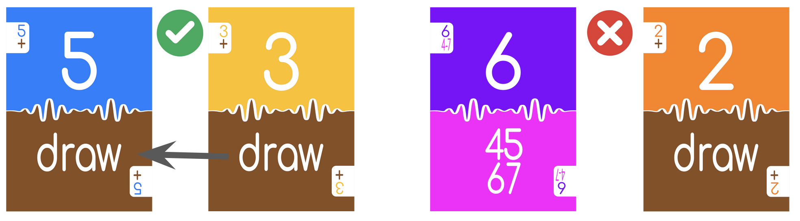

Wild matches any number, range, or draw

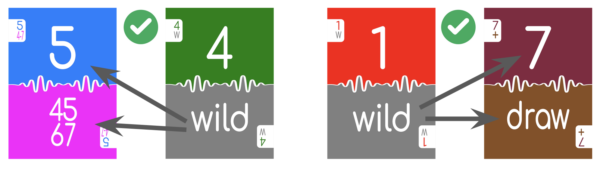

Null matches nothing, including another null or a wild

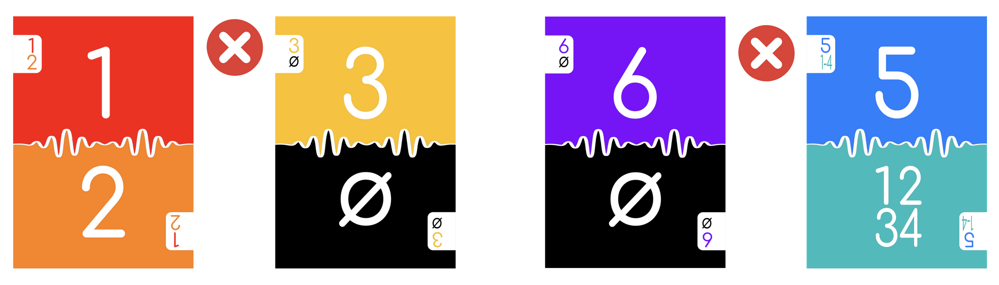

## Double-Matching Rules

If your card has one item that matches the last card, and the other item matches the next-to-last card, you get to play again!

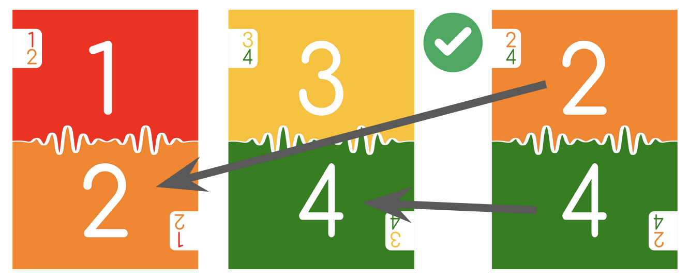

When this happens, your next card can double-match again on what are now the two last cards! You can keep it going as long as you can match the last two cards.

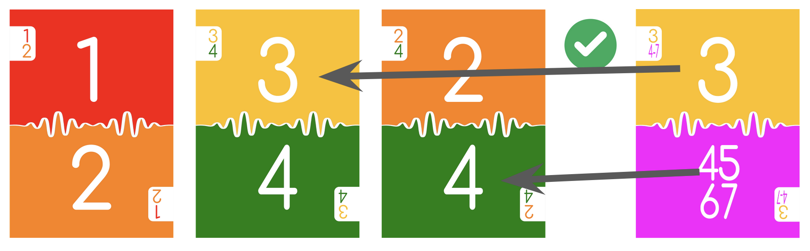

A null doesn’t prevent double-matching, as long as both items on your card can match the last two cards.

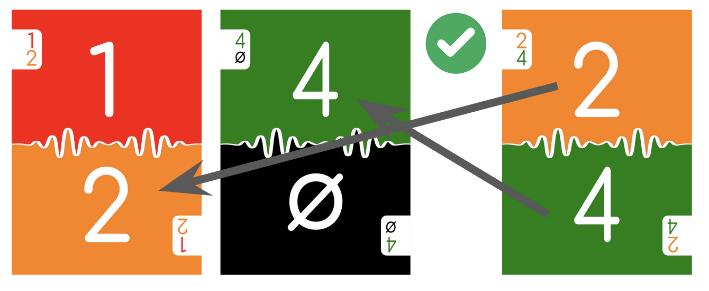

A null does not match a wild, so it can prevent a double-match if your card’s other item doesn’t match something on the last two cards. You are allowed to play this card, but it ends your turn.

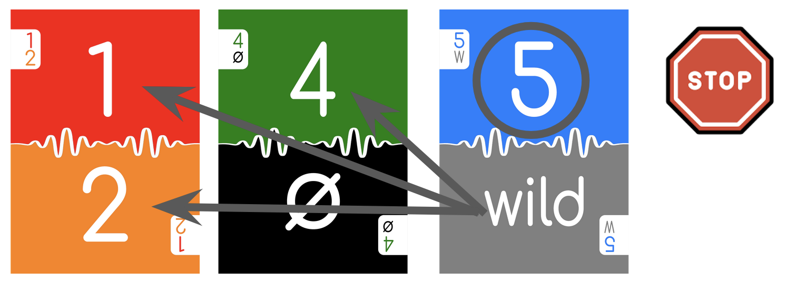

To double-match, one item has to match the last card, and the other item has to match the next-to-last card. The same item can’t match both cards. You are allowed to play this card, but it ends your turn.

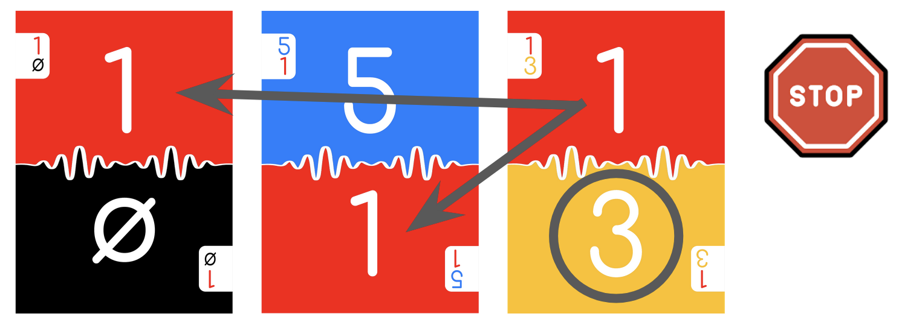

Remember that you can’t play at all if your card doesn’t match something on the last card, even if it matches the next-to-last card.

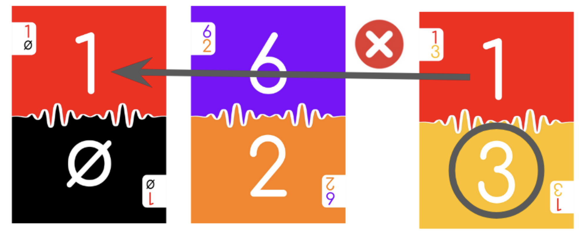

## Reverse Matching

In a reverse-matching turn, you may _not_ play a card if it matches the last card.

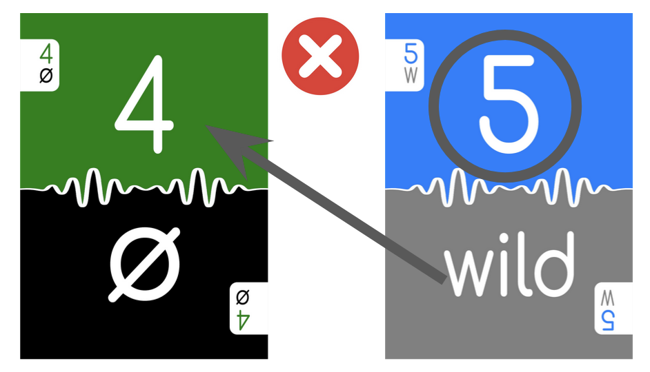

If your card does not match the last card, but does match the next-to-last card, you may play, but it ends your turn.

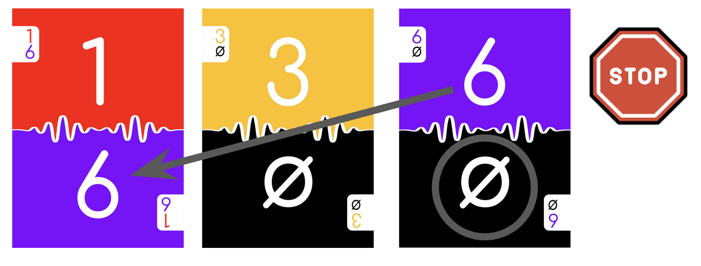

If your card matches nothing on the last card, and also matches nothing on the next-to-last card, you may continue your turn.

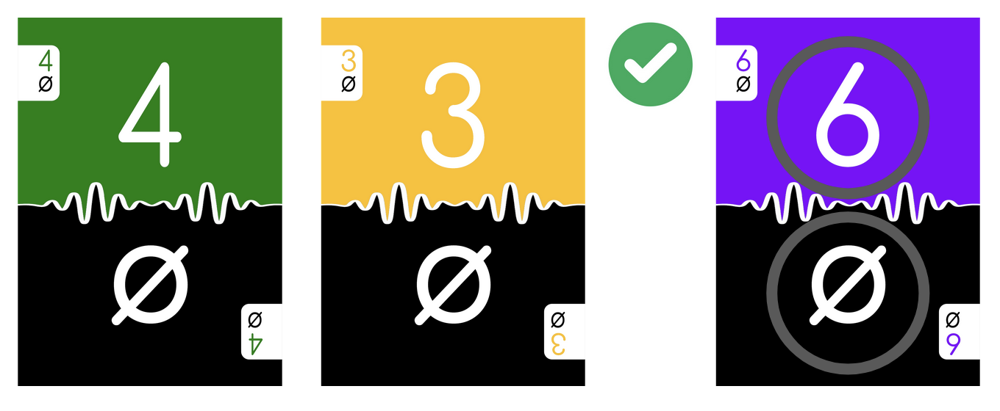
